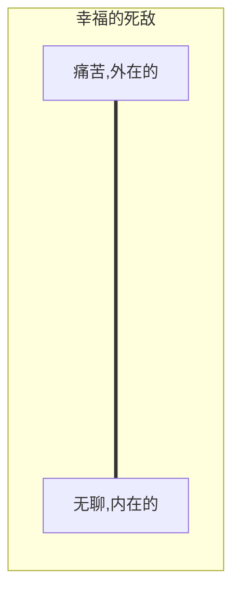

20220204
人生的智慧
# 1. 基本的划分
> 幸福不是容易的事  
> 很难求之于自身，  
> 但要想在别处得到则不可能。

1. 人的自身  
属于人的个性的东西，健康、力量、外貌、气质等
2. 人所拥有的身外之物  
所有意义上的占有物，财产等
3. 人向其他人所显示的样子  
其他人眼中所呈现的样子，人们对他的看法，名誉、地位和名声

## 1.1 人的自身
>无论身在何处，  
>我们只能在我们自身寻找或者获得幸福

- 健康  
幸福十占其九依赖于我们的健康
愉悦心情  
同一件事情，‘郁闷’型和‘愉快’型的人会有完全相反的感受

- 精神修养  
一个人的自身拥有越丰富，他对身外之物的需求也就越少，别人对他来说就越不重要。卓越的精神思想会导致一个人不喜与他人交往。  
一个人对与人交往的热衷程度，与他贫乏的思想和总体的平庸成正比。人们在这个世界上要么选择独处，要么选择庸俗。

- 与自己独处  
常人考虑如何打发时间，而略具才华的人却考虑如何利用时间。闲暇时每一个人的生命存在开出的花朵，因为也只有闲暇使人得以把握、支配自身，所以那些自身具备某些价值的人才可以称得上是幸福的。而绝大多数的人，闲暇只会造就出无用的家伙，无所事事，无聊烦闷，其自身成了负担。

- 三种生理基本能力  
1. 机体新陈代谢能力所带来的快乐。（吃、喝、休息、睡觉）  
2. 发挥肌肉力量所带来的快乐。（步行、跳跃、跳舞）  
3. 施展感觉能力方面的快乐。（思考、写作、学习、阅读）（优胜与动物之处）  

# 5. 建议和格言
## 5.1 泛论
- 幸福不在于我们获得了多少快乐，而在于我们成功避免了多少痛苦。  
> 理性的人寻求的不是快乐，而只是没有痛苦  
   
所有的快乐，其本质都是否定的，而痛苦的本质却是肯定的。当我们整个身体健康无恙，只有一小处地方受伤，那我们身体的整体健康并不会进入我们的意识，我们的注意力始终只集中在那疼痛的伤处，总体舒适的感觉就会因一小处伤痛而烟消云散。  

没有什么人、事值得我们过分操心。困难得失都会过去，都会离开这个世界，这都是微不足道的。  

我们要提醒自己不要向生活提出太多的要求，因为如果这样做，我们的幸福所依靠的基础就变得太广大了，遭遇意外事故的机会也会增多。  

## 5.2 我们对待自己的态度

珍惜当下，让过去过去，今天只有一次，永远不会再来。

- 反省  

要过一种深思熟虑的生活，并且从生活经验中汲取一切有益的教训，我们就必须勤于反省。回顾整理做过的事情与曾经有过的感觉和体验；还要把我们以前对事情的判断和现在的看法，以前定下的计划及追求和最终得到的结果及满足互相比较。这是人生经验提供的单独反复温习。

- 独处  

首先要学会承受孤独，因为孤独是幸福、安乐的源泉。一个人的自身拥有越多，那么别人能狗给予他的也就越少。正是某种自身充足的感觉使具有内在丰富价值的人不愿为了与他人交往而做出所需的、显而易见的牺牲。

人们好像把无聊当作某种不幸和灾祸，所以他们聚在一起，目的就是患难与共，一起无聊。人们对社会交往的渴望归根结底也不是一种直接的渴望，并不是基于对社会人群的喜爱，而是出自对孤独的恐惧，躲避孤独带来的凄凉和压抑，躲避自己单调乏味的思想意识。

- 嫉妒

嫉妒是一种罪恶又是一种不幸。不跟别人比较的话，我们会为我们所得到的感到快乐，如果由于别人比我们更加幸运而内心不安，那我们将永远不会快乐。

- 想象

对一切涉及痛苦和快乐的事情，我没都应该把牢想象力的闸门。    

在遭受已经发生、不可更改的不幸时，我们甚至不可以允许自己认为事情本来可以有另外的结局，更加不可以设想我们本来可以阻止这一不幸的发生。因为这种想法只能加剧痛苦至难以忍受的程度。    
但这一规则也有它的片面性。我们不应该在明显犯下错误以后为自己开脱责任，我们应该坦白承认错误，清楚明白这些错误的严重性，避免重蹈覆辙。  

对当初如何才能防止这一不幸进行一番反复痛苦的思考，是我们应该执行的某种有益的体罚，以便吃一堑长一智。不接受惩罚教训就不可能进步。

- 专注

我们在处理某一事情时，其他别的一切事情则一概不予考虑，清空头脑，在恰当的时间里只操心、享受、忍耐一样事情，其他的则完全想都不想。

- 健康

我们可以从事适宜的劳作以锻炼肌肉，却应该保护神经不受操劳。在剧烈的肌肉运动之时或之后，都应该让大脑得到休息。这是因为运动神经和感觉神经是大同小异的，正如我们受伤的四肢所感受到的疼痛其实发自大脑。所以如果我们强迫大脑同时进行剧烈的体力活动和紧张到精神活动，或者两种活动间隔很短时间，那么很明显大脑就会受到损害。

## 5.3 我们对他人应采取的态度

要在这个世界上生活顺当，具备相当的预见能力和宽恕能力是最好的。

一个人无法改变自己的真实个性，亦即无法改变自己的道德性格、认知能力、长相脾性等待。所以为了能在人群中生存，我们必须容忍和承认别人以既定的个性存在，不管这种个性到底是什么。

我们关心的只是如何以一个人的本性和特质所允许的方式利用这个人，既不应该希望改变也不可以干脆谴责这个人的本性。这就是“生活，也让别人生活”这句格言的含义。

针对别人行为动怒，就跟向一块滚到我们前进路上的石头大发脾气同等的愚蠢。
> 我不准备改变他们，我要利用他们。

